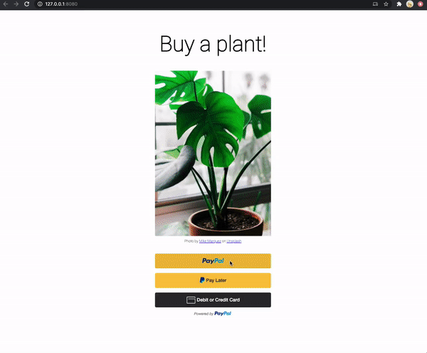

# Checkout standard integration

This integration sets up online payment options using the PayPal JavaScript SDK. The JavaScript SDK displays relevant, PayPal-supported payment methods on your page, which gives your buyers a personalized and streamlined checkout experience.

  
### Demo

### How to run locally
1. Clone the repo  `git clone git@github.com:paypal/CodeTalks.git`
2. Run `npm install`
3. Run `npm start`
4. Navigate to `http://127.0.0.1:8080/`

                                                                            
### Documentation: 
1. Standard Integration: https://developer.paypal.com/docs/business/checkout/set-up-standard-payments/
2. JavaScript SDK reference: https://developer.paypal.com/docs/business/javascript-sdk/javascript-sdk-reference/